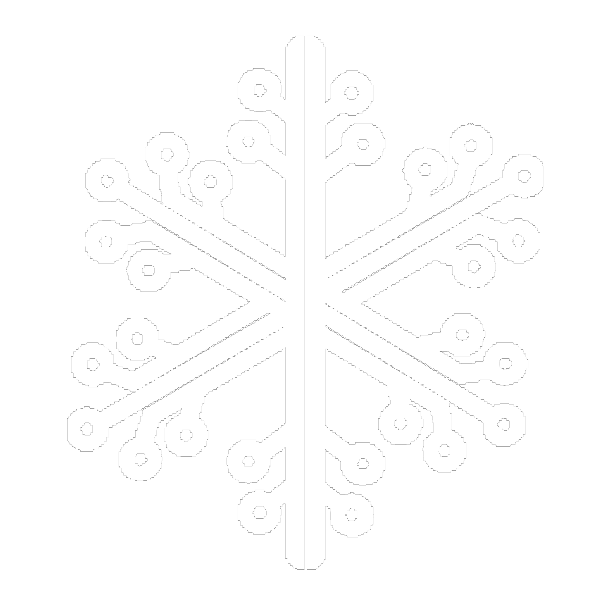

<!-- Banner -->

<!-- Logo -->
<br />
<div align="center">
  <a href="https://github.com/zyx-0314/">
    
  </a>
  <p> Full Stack Enginner </p>
</div>

<p align="center">
  <a href="https://app.daily.dev/iancedricramirez"></a>
</p>

<br />

<p align="center">
<a href="https://ian-cedric-ramirez.vercel.app/">
  
</a>
<a href="https://www.figma.com/@nyebecreations">
  
</a>
<a href="https://www.linkedin.com/in/ian-cedric-ramirez">
  
</a>
<a href="https://www.facebook.com/ramirez.zyx.14/">
  
</a>
<br />
</p>

[](https://user-badge.committers.top/philippines_private/zyx-0314)


**:eyes: Bio_Data.yml:**

```yaml
name: Ian Cedric 'Zyx' Ramirez
located_in: Philippines
from: Philippines
job: Full Stack Engineer 
education: [ "Bachelor's in Computer Science", "Masters in Information technology - Cyber Security (Ongoing)" ]
company: People Dynamic's Inc.
```
**:zzz: Experience.json:**
```json
"2025": [
  {
    "title": "Instructor I - Web Developer",
    "company": "Far Eastern University - Institute of Technology",
    "location": "Sampaloc, Manila, Philippines",
    "dates": "January - December ",
    "duration": "1 year",
  },
],
"2024": [
  {
    "title": "Instructor I - Web Developer",
    "company": "Far Eastern University - Institute of Technology",
    "location": "Sampaloc, Manila, Philippines",
    "dates": "January - December ",
    "duration": "1 year",
  },
],
"2023": [
  {
    "title": "Software Engineer - Intern",
    "company": "Argon Software",
    "location": "Daraga, Albay, Philippines",
    "dates": "March - June",
    "duration": "4 months",
  },
  {
    "title": "Instructor I",
    "company": "Far Eastern University - Institute of Technology",
    "location": "Sampaloc, Manila, Philippines",
    "dates": "October - December ",
    "duration": "3 months",
  },
],
```

**:screwdriver:Technical_Background.json**
```json
{
  "Web-Dev": [
    "Front-End Development",
    "Back-End Development"
  ],
  "Data-Science": [
    "Data Analysis",
    "Data Visualization"
  ],
  "Game-Dev": [
    "Game Design",
    "Game Development"
  ],
  "Instructor": [
    "College Level"
  ],
}
```

**:computer: Languages & Tools:**

:bar_chart: Data Science:

[![Python][python.com]][python-url]

:video_game: Game Dev:

[![C++][cpp.com]][cpp-url] - [![C#][csharp.com]][csharp-url]

:iphone: Mobile Dev:

[![Kotlin][kotlin.com]][kotlin-url] - [![ReactNative][reactnative.com]][reactnative-url]

:computer: Cross-Platform:

 - 

:pager: Web Dev:

[![NextJS][NextJS.com]][NextJS-url] - [![ReactJS][ReactJS.com]][ReactJS-url]

[![Laravel][Laravel.com]][Laravel-url] - [![NodeJS][NodeJS.com]][NodeJS-url]

[![TailwindCSS][TailwindCSS.com]][TailwindCSS-url] - [![Bootstrap][Bootstrap.com]][Bootstrap-url]

[![Yii2][Yii2.com]][Yii2-url] - [![CodeIgniter4][CodeIgniter4.com]][CodeIgniter4-url]

[![WordPress][WordPress.com]][WordPress-url] - [![Symfony][Symfony.com]][Symfony-url]

:bank: Database

[![MySQL][Mysql.com]][Mysql-url] - [![MariaDB][MariaDB.com]][MariaDB-url] - [![MongoDB][MongoDB.com]][MongoDB-url]

:wrench: Tools:

[![AI][Docker.com]][Docker-url] - [![Postman][Postman.com]][Postman-url] 

[![Github][Github.com]][Github-url] - [![Android-studio][Android-studio.com]][Android-studio-url] 

[![Visual-studio-code][Visual-studio-code.com]][Visual-studio-code-url] - [![Unity][Unity.com]][Unity-url] 

[![Unreal-engine][unreal-engine.com]][unreal-engine-url] - [![Insomia][insomia.com]][insomia-url]

**:notebook: Github_Stats.json:**

<div align="center" float="left">
  <p>
    
    
  </p>
  </img>

  <br/>
  </img>
  
</div>

<br/>
<br/>

---

**:notebook: Other_Info.json:**
```json
{
  "fields_of_interests": [
    "AI",
    "Robotics",
    "Game Design",
    "Data Science",
    "Game Development",
    "Website Development",
    "Software Development"
  ]

  "currently_learning": [
    "Cloud Services",
    "Cyber Security",
    "DevOps",
  ]

  "hobbies": [
    "Air-Soft",
    "Anime - Manga",
    "Games",
    "Music",
    "Travel",
    "Running",
    "Swimming",
    "Hike",
  ]
}
```

---

<br/>

**:zap: Projects:**
<h3>Ongoing 🟢</h3>

```json
[
  {
    "type": "Personal Website 2.0",
    "description": "This project will be the version 2 for my personal portfolio.",
    "features": [
      "CMS.",
      "Responsive.",
    ],
    "tech": ["Next.js, PostgreSQL, ShadCN"],
    "remarks": "Showcase Freelancing."
  },
  {
    "type": "SaaS Inventory System",
    "description": "This project is personal project for organizations I belong.",
    "features": [
      "CMS.",
      "Inventory.",
    ],
    "tech": ["Next.js, PostgreSQL, ShadCN"],
    "remarks": "Multi Tenant Inventory System."
  },
]

```

<h3>Done ✔️</h3>

```json
[
  {
    "type": "Template Projects for Cross Platform Softwares with Databases and Web Application",
    "description": "This project provides templates for developing cross-platform software integrated with various databases and web applications. It is designed for competition use, organizational tooling, and skill enhancement, utilizing modern technologies for scalable and maintainable solutions.",
    "features": [
      "Cross-Platform Compatibility: Use Tauri and Electron for Windows, macOS, and Linux applications.",
      "Full-Stack Integration: Build web apps with Next.js and use Prisma for database interaction.",
      "Modular and Scalable Design: Enhance code reusability and maintain a consistent UI/UX with ShadCN.",
      "Efficient Database Management: Support SQLite, MongoDB, and MySQL.",
      "Skill Enhancement: Provide documentation and pre-configured environments for streamlined development."
    ],
    "tech": ["Tauri, Electron, Next.js, SQLite, MongoDB, MYSQL, Prisma, ShadCN"],
    "remarks": "Ideal for competitions and organizational projects, these templates foster skill growth and efficient project execution."
  },
  {
    "type": "File Management System",
    "description": "A centralized platform for managing and organizing documents, providing quick access to essential data with location details.",
    "features": [
      "Efficient CRUD operations for documents with customizable information fields.",
      "Association of documents with specific categories and file locations for easy retrieval.",
      "Streamlined document tracking and management capabilities."
    ],
    "tech": "Next.js",
    "remarks": "Commissioned project designed for local hosting, with JSON file saving functionality."
  },
  {
    "type": "Portfolio Page",
    "description": "A comprehensive platform showcasing the projects and works of a local church, serving as a digital resume.",
    "features": [
      "Interactive display of projects highlighting the church's achievements and initiatives.",
      "Functions as a professional resume providing detailed information about the church's memberships and activities."
    ],
    "tech": ["Next.js", "Tailwind CSS"],
    "link": {
      "UI/UX": "https://www.figma.com/community/file/1268740358486001871/Portfolio-Project",
      "Source Code": "https://github.com/zyx-0314/portfolio",
      "Deployed": "https://ian-cedric-ramirez.vercel.app/"
    }
  },
  {
    "type": "Local Church Membership Management System",
    "description": "A robust system for managing membership information and documents within the local church community.",
    "features": [
      "Comprehensive CRUD functionality for member documents with detailed tracking and updating capabilities.",
      "Efficient tracking of registered and requested documents, ensuring smooth document flow within the church.",
      "Integration with Firebase for secure data storage and management."
    ],
    "tech": ["Next.js", "Firebase", "Emotion CSS", "Tailwind CSS"],
    "remarks": "Commissioned project tailored for efficient church membership management."
  },
  {
    "type": "Ecommerce CMS",
    "description": "A versatile content management system designed to manage multiple ECommerce platforms efficiently.",
    "features": [
      "Comprehensive CRUD operations for products, orders, and promotions across multiple ECommerce platforms.",
      "Efficient order tracking and management for streamlined business operations."
    ],
    "tech": ["Next.js", "MySQL", "Tailwind CSS"],
    "link": {
      "Deployed": "https://ecommerce-cms-sample-project.vercel.app/"
    }
  },
  {
    "type": "Ecommerce",
    "description": "An intuitive Ecommerce website seamlessly connected to a CMS, providing a user-friendly interface for customers.",
    "features": [
      "Dynamic display of promotions and available products, enhancing the shopping experience for customers.",
      "Efficient order tracking and management for customer convenience."
    ],
    "tech": ["Next.js", "Tailwind CSS"],
    "link": {
      "Deployed": "https://store-1-ecommerce-sample-project.vercel.app/"
    }
  },
  {
    "type": "Water Station System",
    "description": "An intuitive Point of Sale (POS) system tailored for water stations, equipped with advanced analytics and robust asset and financial tracking capabilities.",
    "features": [
      "Comprehensive inventory management for tracking water products and supplies.",
      "Interactive statistics dashboard offering insightful data visualization and analysis directly from the database.",
      "Detailed activity logs to monitor the actions and performance of employees in charge, ensuring accountability and efficiency."
    ],
    "tech": ["Next.js, SQLite, Prisma, ShadCN"],
    "remarks": "Commissioned project designed for local hosting, providing seamless integration with existing infrastructure."
  }
]

```


<br/>

---

<br/>

**My Time 🦉** 

```text
🌅 Morning                                    ████████░░░░░░░░░░░░░░░░░   35.25 % 
☀️ Afternoon                                  █░░░░░░░░░░░░░░░░░░░░░░░░   04.88 % 
🌃 Evening                                    ██████████████░░░░░░░░░░░   59.87 % 
```

**Credits 🔖**

```yaml
tutorial_path: guilyx/guilyx/how-to.md
original_idea: natemoo-re
improved_by: andyruwruw
note: thanks to both of them!
```

<p align="center">
  
</p>

[Laravel.com]: https://img.shields.io/badge/Laravel-FF2D20?style=for-the-badge&logo=laravel&logoColor=white
[Laravel-url]: https://laravel.com
[MySQL.com]: https://img.shields.io/badge/MySQL-00000F?style=for-the-badge&logo=mysql&logoColor=white
[MySQL-url]: https://www.mysql.com
[MariaDB.com]: https://img.shields.io/badge/MariaDB-003545?style=for-the-badge&logo=mariadb&logoColor=white
[MariaDB-url]: https://mariadb.org
[MongoDB.com]: https://img.shields.io/badge/MongoDB-003545?style=for-the-badge&logo=mongodb&logoColor=white
[MongoDB-url]: https://mongodb.org
[NodeJS.com]: https://img.shields.io/badge/Node.js-339933?style=for-the-badge&logo=node.js&logoColor=white
[NodeJS-url]: https://nodejs.org/en/
[NextJS.com]: https://img.shields.io/badge/Next-black?style=for-the-badge&logo=next.js&logoColor=white
[NextJS-url]: https://nextjs.org
[ReactJS.com]: https://img.shields.io/badge/React-20232A?style=for-the-badge&logo=react&logoColor=61DAFB
[ReactJS-url]: https://reactjs.org
[TailwindCSS.com]: https://img.shields.io/badge/Tailwind_CSS-38B2AC?style=for-the-badge&logo=tailwind-css&logoColor=white
[TailwindCSS-url]: https://tailwindcss.com
[Bootstrap.com]: https://img.shields.io/badge/Bootstrap-563D7C?style=for-the-badge&logo=bootstrap&logoColor=white
[Bootstrap-url]: https://getbootstrap.com
[Yii2.com]: https://img.shields.io/badge/Yii2-34495E?style=for-the-badge&logo=yii&logoColor=white
[Yii2-url]: https://www.yiiframework.com
[CodeIgniter4.com]: https://img.shields.io/badge/CodeIgniter%204-EF4223?style=for-the-badge&logo=codeigniter&logoColor=white
[CodeIgniter4-url]: https://codeigniter.com
[WordPress.com]: https://img.shields.io/badge/WordPress-21759B?style=for-the-badge&logo=wordpress&logoColor=white
[WordPress-url]: https://wordpress.org
[Symfony.com]: https://img.shields.io/badge/Symfony-000000?style=for-the-badge&logo=symfony&logoColor=white
[Symfony-url]: https://symfony.com


[Docker.com]: https://img.shields.io/badge/Docker-2CA5E0?style=for-the-badge&logo=docker&logoColor=white
[Docker-url]: https://www.docker.com
[Postman.com]: https://img.shields.io/badge/Postman-FF6C37?style=for-the-badge&logo=postman&logoColor=white
[Postman-url]: https://www.postman.com
[Github.com]: https://img.shields.io/badge/GitHub-100000?style=for-the-badge&logo=github&logoColor=white
[Github-url]: https://github.com
[Android-studio.com]: https://img.shields.io/badge/Android_Studio-3DDC84?style=for-the-badge&logo=android-studio&logoColor=white
[Android-studio-url]: https://developer.android.com/studio
[Visual-studio-code.com]: https://img.shields.io/badge/Visual_Studio_Code-0078D4?style=for-the-badge&logo=visual-studio-code&logoColor=white
[Visual-studio-code-url]: https://code.visualstudio.com
[Unity.com]: https://img.shields.io/badge/Unity-100000?style=for-the-badge&logo=unity&logoColor=white
[Unity-url]: https://unity.com
[unreal-engine.com]: https://img.shields.io/badge/Unreal_Engine-313131?style=for-the-badge&logo=unreal-engine&logoColor=white
[unreal-engine-url]: https://www.unrealengine.com/en-US/
[insomia.com]: https://img.shields.io/badge/Insomnia-5849BE?style=for-the-badge&logo=insomnia&logoColor=white
[insomia-url]: https://insomnia.rest

[cpp.com]: https://img.shields.io/badge/C++-00599C?style=for-the-badge&logo=c%2B%2B&logoColor=white
[cpp-url]: https://www.cplusplus.com
[csharp.com]: https://img.shields.io/badge/C%23-239120?style=for-the-badge&logo=c-sharp&logoColor=white
[csharp-url]: https://docs.microsoft.com/en-us/dotnet/csharp/

[python.com]: https://img.shields.io/badge/Python-3776AB?style=for-the-badge&logo=python&logoColor=white
[python-url]: https://www.python.org

[kotlin.com]: https://img.shields.io/badge/Kotlin-0095D5?style=for-the-badge&logo=kotlin&logoColor=white
[kotlin-url]: https://kotlinlang.org
[reactnative.com]: https://img.shields.io/badge/React_Native-20232A?style=for-the-badge&logo=react&logoColor=61DAFB
[reactnative-url]: https://reactnative.dev
