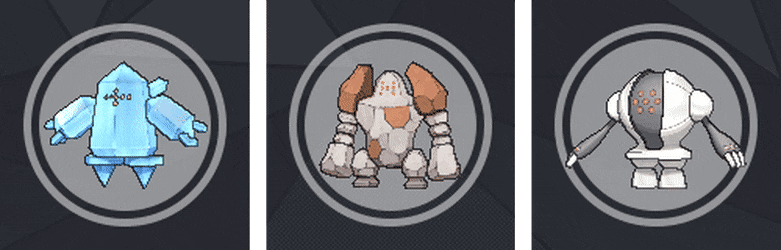
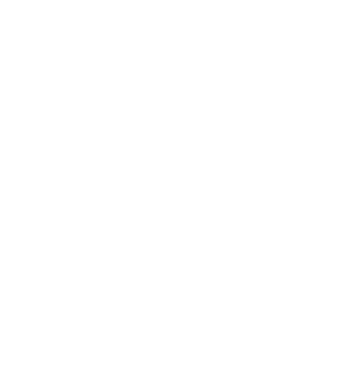

<!-- Banner -->
<p align="center">
  
</p>

<!-- Logo -->
<br />
<div align="center">
  <a href="https://github.com/zyx-0314/">
    
  </a>
  <p> Aspiring Software Engineer 🧑‍💻 </p>

</div>

<br />

<p align="center">
<a href="https://www.linkedin.com/in/erwinlejeune-lkn">
  
</a>
<a href="https://www.linkedin.com/in/erwinlejeune-lkn">
  
</a>
<br>
</p>

**:eyes: Bio_Data.yml:**

```yaml
name: Zyx Ramirez
located_in: Philippines
from: Philippines
job: Software Engineer - Intern
education: [ "Bachelor's in Computer Science" ]
company: Argon Software
```
**:zzz: Experience.json:**
```json
"2023": [
  {
    "title": "Software Engineer - Intern",
    "company": "Argon Software",
    "location": "Philippines",
    "from": "March 2023 - Present",
  }
]

```

**:screwdriver:Technical_Background.json**
```json
{
  "Web-Dev": [
    "Front-End Development",
    "Back-End Development"
  ],
  "Data-Science": [
    "Data Analysis",
    "Data Visualization"
  ],
  "Game-Dev": [
    "Game Design",
    "Game Development"
  ]
}
```

**:computer: Languages & Tools:**

[![NextJS][NextJS.com]][NextJS-url] - [![ReactJS][ReactJS.com]][ReactJS-url]

[![Laravel][Laravel.com]][Laravel-url] - [![NodeJS][NodeJS.com]][NodeJS-url]

[![TailwindCSS][TailwindCSS.com]][TailwindCSS-url] - [![Bootstrap][Bootstrap.com]][Bootstrap-url]

[![MySQL][Mysql.com]][Mysql-url] - [![MariaDB][MariaDB.com]][MariaDB-url]

[![AI][Docker.com]][Docker-url] - [![Postman][Postman.com]][Postman-url] - [![Github][Github.com]][Github-url] - [![Android-studio][Android-studio.com]][Android-studio-url] - [![Visual-studio-code][Visual-studio-code.com]][Visual-studio-code-url] - [![Unity][Unity.com]][Unity-url] - [![Unreal-engine][unreal-engine.com]][unreal-engine-url] - [![Insomia][insomia.com]][insomia-url]

**:notebook: Other_Info.json:**
```json
{
  "fields_of_interests": [
    "AI",
    "Robotics",
    "Game Design",
    "Data Science",
    "Game Development",
    "Website Development",
    "Software Development"
  ]

  "currently_learning": [
    "NextJS",
    "Non-RDB"
  ]

  "will_learn": [ "NodeJS" ]

  "hobbies": [
    "Air-Soft",
    "Anime - Manga",
    "Games",
    "Music",
    "Travel"
  ]
}
```

---

<br/>

**:zap: Projects:**
<small> Soon to come! </small>

<br/>

---

<br/>

**🐱 My GitHub Data** 

> 📦 325.0 kB Used in GitHub's Storage 
 > 
> 🏆 313 Contributions in the Year 2023
 > 
> 💼 Opted to Hire
 > 
> 📜 42 Public Repositories 
 > 
> 🔑 12 Private Repositories 
 > 

<br/>

---

<br/>

**My Time 🦉** 

```text
🌞 Morning                                    █░░░░░░░░░░░░░░░░░░░░░░░░   04.45 % 
🌆 Daytime                                    ████████░░░░░░░░░░░░░░░░░   31.86 % 
🌃 Evening                                    ███████████░░░░░░░░░░░░░░   44.57 % 
🌙 Night                                      █████░░░░░░░░░░░░░░░░░░░░   19.12 % 
```

```yaml
tutorial_path: guilyx/guilyx/how-to.md
original_idea: natemoo-re
improved_by: andyruwruw
note: thanks to both of them!
```

<p align="center">
  
</p>

[Laravel.com]: https://img.shields.io/badge/Laravel-FF2D20?style=for-the-badge&logo=laravel&logoColor=white
[Laravel-url]: https://laravel.com
[MySQL.com]: https://img.shields.io/badge/MySQL-00000F?style=for-the-badge&logo=mysql&logoColor=white
[MySQL-url]: https://www.mysql.com
[MariaDB.com]: https://img.shields.io/badge/MariaDB-003545?style=for-the-badge&logo=mariadb&logoColor=white
[MariaDB-url]: https://mariadb.org
[NodeJS.com]: https://img.shields.io/badge/Node.js-339933?style=for-the-badge&logo=node.js&logoColor=white
[NodeJS-url]: https://nodejs.org/en/
[NextJS.com]: https://img.shields.io/badge/Next-black?style=for-the-badge&logo=next.js&logoColor=white
[NextJS-url]: https://nextjs.org
[ReactJS.com]: https://img.shields.io/badge/React-20232A?style=for-the-badge&logo=react&logoColor=61DAFB
[ReactJS-url]: https://reactjs.org
[TailwindCSS.com]: https://img.shields.io/badge/Tailwind_CSS-38B2AC?style=for-the-badge&logo=tailwind-css&logoColor=white
[TailwindCSS-url]: https://tailwindcss.com
[Bootstrap.com]: https://img.shields.io/badge/Bootstrap-563D7C?style=for-the-badge&logo=bootstrap&logoColor=white
[Bootstrap-url]: https://getbootstrap.com

[Docker.com]: https://img.shields.io/badge/Docker-2CA5E0?style=for-the-badge&logo=docker&logoColor=white
[Docker-url]: https://www.docker.com
[Postman.com]: https://img.shields.io/badge/Postman-FF6C37?style=for-the-badge&logo=postman&logoColor=white
[Postman-url]: https://www.postman.com
[Github.com]: https://img.shields.io/badge/GitHub-100000?style=for-the-badge&logo=github&logoColor=white
[Github-url]: https://github.com
[Android-studio.com]: https://img.shields.io/badge/Android_Studio-3DDC84?style=for-the-badge&logo=android-studio&logoColor=white
[Android-studio-url]: https://developer.android.com/studio
[Visual-studio-code.com]: https://img.shields.io/badge/Visual_Studio_Code-0078D4?style=for-the-badge&logo=visual-studio-code&logoColor=white
[Visual-studio-code-url]: https://code.visualstudio.com
[Unity.com]: https://img.shields.io/badge/Unity-100000?style=for-the-badge&logo=unity&logoColor=white
[Unity-url]: https://unity.com
[unreal-engine.com]: https://img.shields.io/badge/Unreal_Engine-313131?style=for-the-badge&logo=unreal-engine&logoColor=white
[unreal-engine-url]: https://www.unrealengine.com/en-US/
[insomia.com]: https://img.shields.io/badge/Insomnia-5849BE?style=for-the-badge&logo=insomnia&logoColor=white
[insomia-url]: https://insomnia.rest
